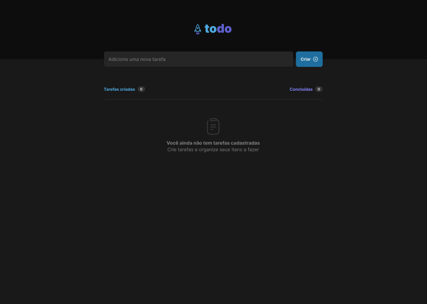
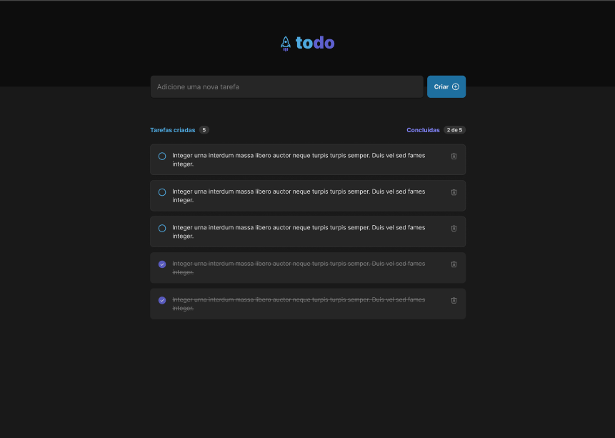

# rocketseat_desafio_01_todo_list

# Sobre o desafio

Nesse desafio, você vai desenvolver uma aplicação de controle de tarefas no estilo to-do list, que contém as seguintes funcionalidades:

- Adicionar uma nova tarefa
- Marcar e desmarcar uma tarefa como concluída
- Remover uma tarefa da listagem
- Mostrar o progresso de conclusão das tarefas

# Layout da aplicação
| 
| :---: | :---: |

## Tecnologias

Este projeto foi feito utilizando as seguintes tecnologias:

- [VITE](https://vitejs.dev/)
- [React](https://reactjs.org/)
- [Typescript](https://www.typescriptlang.org/)


### Tutorial de instalação

Clone o projeto

```term

git clone git@github.com:moraes3000/rocketseat_desafio_01_todo_list.git

```

Instale as dependências

```term

yarn

```

Rode o projeto

```term

yarn dev

```

Acesse [http://localhost:3000](http://localhost:3000/) para ver o resultado.